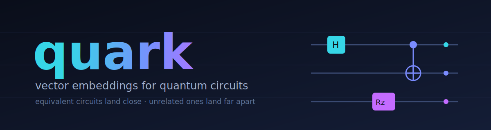
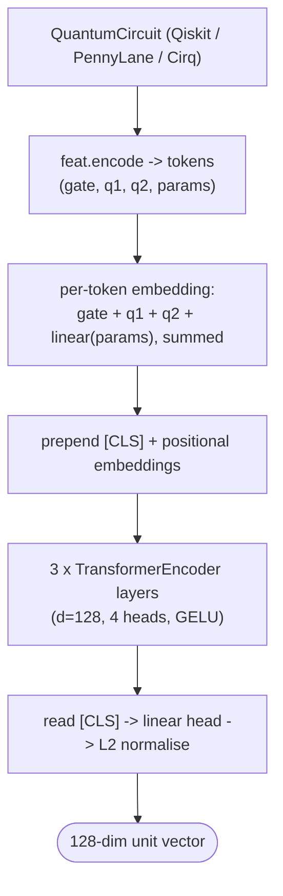

<p align="center">
  
</p>

<p align="center">
  
  
  
  
  
  
</p>

# quark

A small machine-learning library that turns quantum circuits into vectors. If two circuits compute the same thing (the same unitary), their vectors should be close. If they compute different things, their vectors should be far apart. That is the whole pitch.

"the basic concept of this is that quantum programs can be written a ton of different ways even when they do the exact same thing, and checking if two of them are actually the same is super slow ; so this turns each program into a little set of numbers like a fingerprint, and the ones that do the same thing end up with similar fingerprints. that way you can instantly spot duplicates or find similar ones instead of doing all that slow math. basically it makes quantum code searchable kinda like reverse image search for photos, which people hadnt really done before."

It plugs into Qiskit and PennyLane, ships with a pretrained model, and includes a CLI tool that points at a folder of QASM files and tells you which ones are duplicates.

```python
from qiskit import QuantumCircuit
from quark import load_pretrained, embed

m = load_pretrained()   # bundled with the package — no separate download

a = QuantumCircuit(3); a.h(0); a.cx(0, 1); a.cx(1, 2)
b = QuantumCircuit(3); b.h(0); b.h(0); b.h(0); b.cx(0, 1); b.cx(1, 2)
# `b` is `a` with three Hadamards on qubit 0 instead of one — same unitary
# (because H·H·H = H), just written longer.

ea, eb = embed(m, [a, b])
print((ea * eb).sum().item())   # ≈ 0.96 — close; unrelated circuits sit near 0
```

> [!TIP]
> Embedding ~1,000 small circuits takes about a second on a CPU — the model is 647k parameters, so you rarely need a GPU.

## the problem this solves

Quantum software repositories tend to grow messy fast. Researchers paste circuits from papers, students rewrite the same algorithm five different ways, optimisation passes spit out variations of the same circuit, and there is no good way to look at all of it and ask *which of these are actually the same circuit?*

A few obvious ideas don't really work:

- **Hash the gate sequence as a string.** Trivially fooled by reordering a CNOT and an unrelated single-qubit gate that happens to commute.
- **Sort the gates and hash that.** Catches the simplest reorderings, misses anything where the *order* matters.
- **Count how many of each gate.** Better — but blind to which qubits they act on, and can't tell `H X H` from `X` (these *are* the same up to phase, on the right qubit).
- **Compute the full unitary matrix and compare.** This is the real check. It is exponential in the number of qubits and chokes anywhere above ten or so.

Quark sits between these. It learns a similarity metric from training data — circuits and rewrites that *should* be equivalent — and gives you back a fixed-size vector you can put in any nearest-neighbour index. It is wrong sometimes. It is fast always. For a folder of 1,000 small QASM files it runs in seconds where the brute-force unitary check would take days.

A few real things you can use it for:

- **Deduplication.** "I have a folder full of QASM circuits, group the ones that are doing the same thing." There is a CLI for this: `quark dedupe ./circuits/`.
- **Search by example.** "Find circuits in my library that look like this one I just wrote."
- **Optimisation regression checks.** "I just wrote a transpiler pass; did the output drift from the input semantically, or only syntactically?"
- **Clustering.** "What kinds of circuits are common in this repo, by structure?"

What it is *not*:

- A formal verifier. The embedding is a heuristic, not a proof. If you need a yes/no answer, use `quark.verify.equiv` (which computes the full unitary, exponential cost, useful up to about ten qubits).
- A circuit compiler. It does not transpile, optimise, or otherwise modify circuits. It only encodes them.
- Anything to do with quantum hardware. There is no noise model, no calibration, no IBM/IonQ integration. It runs entirely on CPU on whatever circuit objects you hand it.

## install

```bash
# from a clone (recommended for development)
git clone https://github.com/SamparkBhol/quark
cd quark
pip install -e .

# or straight from GitHub
pip install "git+https://github.com/SamparkBhol/quark.git"
```

Python 3.10 or newer. Pulls in Qiskit, PyTorch, NumPy, click. About 1.5 GB of dependencies because PyTorch is large.

The pretrained weights file `quark.pt` ships inside the package (~2.5 MB), so `load_pretrained()` and `quark dedupe` work straight after a `pip install` with no extra download. If you want to retrain or fine-tune, see the training section below.

## try it

```bash
# interactive: paste two circuits and read off their similarity
streamlit run demo/app.py

# or step through the walkthrough notebook
jupyter notebook examples/quickstart.ipynb
```

## a tiny game: same circuit, or not?

each pair below is two ways of writing a circuit. guess whether quark should call them equivalent (high cosine) or not — then expand to check against what unitary equivalence up to global phase actually says.

<details>
<summary><code>h q0; h q0; h q0</code> &nbsp;—vs—&nbsp; <code>h q0</code></summary>

**equivalent.** `H·H = I`, so three `H`s collapse to one. quark scores this pair ≈ 0.96.
</details>

<details>
<summary><code>s q0</code> &nbsp;—vs—&nbsp; <code>t q0; t q0</code></summary>

**equivalent.** `T = Rz(π/4)`, so `T·T = Rz(π/2) = S`.
</details>

<details>
<summary><code>cx q0,q1</code> &nbsp;—vs—&nbsp; <code>cy q0,q1</code></summary>

**not equivalent.** two different two-qubit unitaries — exactly the confusable pair the *discrimination* benchmark trains quark to keep apart.
</details>

## benchmarks

Three retrieval evaluations, each reproducible from a single command. All numbers are Recall@k: for each query circuit, what fraction of its known-equivalents land in the top-k results sorted by cosine similarity.

### 1. in-distribution (synthetic, same recipe as training)

100 random query circuits. Each query has 2 known-equivalents hidden in a library of 500. The other 498 are unrelated random circuits. Equivalents are produced by chaining four random rewrites drawn from the nine equivalence-preserving rewrites described under *how it works* below.

| method                           | R@1   | R@5   | R@10  |
|----------------------------------|-------|-------|-------|
| md5 of gate sequence             | 0.035 | 0.035 | 0.035 |
| md5 of sorted gate-list          | 0.080 | 0.080 | 0.080 |
| gate-count vector (cosine)       | 0.410 | 0.825 | 0.880 |
| **quark (647k params)**          | **0.500** | **1.000** | **1.000** |

Reproduction:

```
quark train --samples 1500 --epochs 12 --loss infonce --out quark.pt
quark eval  --weights quark.pt --queries 100 --lib 500 --equiv 2
```

### 2. held-out rewrite (the test that actually matters)

The previous benchmark trains and tests on the same nine rewrites. So you have to ask: did the model learn what it means for circuits to be equivalent, or did it just memorise the fingerprint of the rewrite operations?

To check, I retrained leaving out one rewrite (`insert_id`, the one that adds a redundant pair of gates) and evaluated on a pool whose equivalents are produced *only* by that rewrite. The model has never seen `insert_id` during training. If it had been pattern-matching on rewrite signatures, it should fail. If it learned something more general about equivalence, it should still work.

| method            | R@1   | R@5   | R@10  |
|-------------------|-------|-------|-------|
| hash              | 0.000 | 0.000 | 0.000 |
| sorted hash       | 0.000 | 0.000 | 0.000 |
| count vector      | 0.135 | 0.390 | 0.550 |
| **quark**         | **0.470** | **0.970** | **0.985** |

R@10 of 0.985 versus 0.550 for the strongest baseline. The model recovers 98.5% of the held-out equivalences in its top-10 results despite never seeing the rewrite during training. The mechanism that makes this work, I think, is that the inverse rewrite (`cancel_consecutive`) *was* in training — the model learned that pairs of cancelling gates can be ignored, and that knowledge transfers to recognising when those pairs were *added* instead of removed.

Reproduction:

```
python scripts/heldout.py --holdout insert_id --samples 1500 --epochs 12 --loss infonce
```

### 3. QASMBench (real circuits, out of distribution)

The first two benchmarks use synthetic random circuits. Real circuits look different — they have structure, they tend to come from a few specific algorithms (QFT, Grover, VQE ansatzes, error correction), and they do not look like uniform random gate sequences.

QASMBench is a public corpus of small real-world quantum algorithms (adders, basis-change circuits, HHL, VQE variants, Bell states, quantum teleportation, and so on), each provided in two forms: the original high-level QASM and a Qiskit-transpiled version compiled down to a basis gate set like `{rz, sx, cx}`. The transpiled version is mathematically equivalent to the original but has very different gate counts and uses different gates.

This is a hard test for any approach that didn't train on it. The retrieval task: given the high-level form of an algorithm, find its transpiled form in a library of 58 circuits (29 algorithms × 2 forms each).

| method            | R@1   | R@5   | R@10  |
|-------------------|-------|-------|-------|
| hash              | 0.000 | 0.000 | 0.000 |
| sorted hash       | 0.000 | 0.000 | 0.000 |
| count vector      | 0.069 | 0.069 | 0.172 |
| **quark**         | 0.034 | **0.103** | 0.172 |

> [!NOTE]
> The library holds both forms of every algorithm, so a query's own identical copy is in it too. That self-copy is excluded from the query's own results — otherwise it ranks first by definition and pins R@1 to zero for every method regardless of skill.

Honest read: this is the model's weakest result, and in 0.4.0 it is a deliberate trade-off. quark edges the count-vector baseline at R@5 (0.103 vs 0.069), trails it at R@1 (0.034 vs 0.069), and ties it at R@10 (0.172). Earlier versions scored higher here (R@10 ≈ 0.345); the hard-negative training added in 0.4.0 — which fixed a real false-positive bug (see the *discrimination* benchmark below) — also makes the model less willing to call very different circuits equivalent, and matching an algorithm to its transpiled form is exactly that kind of match. Transpilation is a much harder transformation than the simple identities the model trained on (an `adder_n10` goes from 19 high-level gates to 171 native ones), and the model has never seen circuits at that ratio of expansion.

This is reported because hiding it would be misleading. Recovering it without re-introducing false positives is on the roadmap; see the limitations section.

Reproduction:

```
git clone https://github.com/pnnl/QASMBench /tmp/QASMBench
python scripts/qasmbench.py --root /tmp/QASMBench/small --weights quark.pt
```

### 4. discrimination (telling a gate from its inverse)

Recall@k says nothing about *false positives* — does the model ever call two circuits equivalent when they are not? The sharpest version of that question is a gate versus its own inverse. `S` and `S†` are different unitaries, but they differ by a single, parameter-free token, exactly the kind of thing a circuit embedder can miss.

This benchmark builds 60 pairs that are identical except for one gate swapped for a confusable sibling — an inverse (`S`/`S†`, `T`/`T†`, `SX`/`SX†`) or a different two-qubit gate (`CX`/`CY`) — all genuinely non-equivalent, and measures the cosine quark assigns them. Lower is better.

| model              | mean cosine | correctly separated (< 0.9) |
|--------------------|-------------|-----------------------------|
| earlier versions   | ~1.00       | ~0%                         |
| **quark (0.4.0)**  | **0.77**    | **67%**                     |

On the minimal case — two otherwise-identical circuits differing only by `S` vs `S†` — earlier versions returned a cosine of exactly 1.0000: the tokeniser mapped a gate and its inverse to the same id, so their embeddings were bit-for-bit identical. quark 0.4.0 returns about −0.7 for that pair, while still scoring a genuinely-equivalent pair (`H` vs `HHH`) at 0.96. `quark eval` reports this number on every run.

Reproduction:

```
quark eval --weights quark.pt   # prints the discrimination score under the table
```

## how it works

There are two halves: how the model represents a circuit, and how it learns from data.

### turning a circuit into tokens

Every gate in the circuit becomes one token. A token is the sum of four learned vectors:

- the **gate type** — there are 20 buckets (`h`, `x`, `y`, `z`, `s`, `sdg`, `t`, `tdg`, `sx`, `sxdg`, `rx`, `ry`, `rz`, `cx`, `cy`, `cz`, `swap`, plus a fall-through bucket each for unrecognised one- and two-qubit gates, plus a padding token). A gate and its inverse get **distinct** ids (`s`/`sdg`, `t`/`tdg`, `sx`/`sxdg`), as do `cx`/`cy`, so the model can tell them apart — earlier versions collapsed them and reported a gate and its inverse as identical (see the *discrimination* benchmark)
- the **first qubit** the gate acts on (1-indexed; 0 means padding or "no qubit")
- the **second qubit** (also 0 for one-qubit gates)
- the **angle** of any rotation parameter, encoded as `(cos θ, sin θ)` — this is a standard trick to make the encoder smooth in the angle without it caring about the period

Sequences are right-padded to 128 tokens; longer circuits are truncated. (This is the main reason QASMBench transpiled circuits hurt — `adder_n10_transpiled` has 171 gates and we only see the first 128.)

A learnable `[CLS]` token is prepended to the sequence. We then run a small transformer encoder — three layers, four heads, dimension 128, GELU activation. The output at the `[CLS]` position is linearly projected and L2-normalised to give a unit vector in 128 dimensions. That vector is the embedding.

The whole network is 647k parameters. Small enough to be CPU-fast at inference, big enough to learn the patterns in the training set.

### training: contrastive learning with rewrites as positives

The training task is to make embeddings of equivalent circuits close together and embeddings of unrelated circuits far apart. We need to give the model lots of (equivalent, equivalent, unrelated) triples.

The "unrelated" part is easy — just generate two random circuits independently. The "equivalent" part is harder. A reliable way to get an equivalent circuit is to start with a circuit and apply rewrites that are mathematically guaranteed to preserve the unitary. There are a lot of these in quantum computing; quark uses nine:

1. **Insert an identity pair.** `H` followed by another `H` on the same qubit cancels back to the identity. Same for `X·X` and `CNOT·CNOT`. We pick a random place in the circuit and insert a pair.
2. **Cancel a pair.** The inverse — find an existing `H·H` (or any of the others) and remove both.
3. **Commute disjoint gates.** A gate on qubits {0, 1} commutes with a gate on qubits {2, 3}. If we find such a pair, we can swap their order without changing the result.
4. **Merge Rz rotations.** Two consecutive `Rz(α), Rz(β)` on the same qubit fuse into one `Rz(α + β)`.
5. **Split an Rz rotation.** The inverse — find an `Rz(θ)` and replace with two `Rz(θ/2)`.
6. **Named gate ↔ rotation.** `Z = Rz(π)`, `S = Rz(π/2)`, `T = Rz(π/4)`, `X = Rx(π)`, `Y = Ry(π)` (and the daggered forms), all up to global phase. This is what teaches the model that `z` and `rz(π)` are the same operation written two ways.
7. **Clifford conjugation.** `H X H = Z` and `H Z H = X`.
8. **Gate algebra.** `S = T·T`, `Z = S·S`, and `SWAP = three CNOTs`.
9. **Pauli through a CNOT.** An `X` on the control before a CNOT equals an `X` on both qubits after it (`CX·(X⊗I) = (X⊗X)·CX`) — one of the Pauli-propagation rules behind stabiliser reasoning.

Each rewrite is verified for correctness. Tests in `tests/test_pairs.py` check that random small circuits remain unitarily equivalent (up to a global phase) after a chain of these rewrites. The check runs `qiskit.quantum_info.Operator(qc).data`, which is the full matrix — exponential in qubits, but fine for two-qubit and three-qubit test circuits.

For each training step we generate a batch of (anchor, positive, negative) triples. The positives are anchors after a chain of four random rewrites. The loss is symmetric InfoNCE with temperature 0.07 — basically asking the model to identify, given an anchor, which of the in-batch positives belongs to it (and vice versa). The other positives in the batch act as hard negatives, in addition to the explicit negatives. On top of those, each anchor gets a **hard negative**: a near-identical twin of itself with one gate swapped for a confusable sibling (`S`→`S†`, `CX`→`CY`, or a rotation shifted by π) and verified to be a genuinely different unitary. Training against these twins is what stops the model from treating a gate and its inverse as interchangeable.

Training takes about five minutes on a CPU laptop for the default config (1500 triples, 12 epochs, batch 32). The default optimiser is AdamW with a cosine learning-rate schedule.

## CLI

```
quark train       # train a new model on synthetic data
quark eval        # evaluate retrieval against the three baselines
quark bench       # quick end-to-end smoke benchmark (no weights required)
quark dedupe      # find duplicate circuits in a directory of QASM files
quark show        # print a sample (anchor, rewritten) pair
```

Examples:

```
# train your own model
quark train --samples 2000 --epochs 15 --loss infonce --out my-quark.pt

# evaluate it
quark eval --weights my-quark.pt --queries 100 --lib 500 --equiv 2 --out results.json

# find duplicates in a directory
quark dedupe ./my_circuits/ --weights quark.pt --threshold 0.9

# generate and display a (circuit, equivalent rewrite) pair
quark show --n 3 --depth 12 --k 4
```

The `--threshold` for dedupe is a cosine similarity cut-off, defaulting to 0.9. Higher means stricter (fewer false-positive groupings, more missed real equivalents); lower is the opposite. For calibration: the H·H·H / H pair from the top of this README scores about 0.96, while unrelated circuits sit near zero, so 0.9 separates them cleanly. There is also a `--verify` flag that runs full-unitary equivalence on every grouping suggested by the embedding (slow, but useful for production).

## using it from PennyLane or Cirq

Quark internally works on Qiskit `QuantumCircuit` objects. There are adapters that convert from PennyLane and Cirq:

```python
from quark.adapters import from_pennylane, from_cirq, from_qasm

qc_from_pl = from_pennylane(my_pennylane_tape)
qc_from_cirq = from_cirq(my_cirq_circuit)
qc_from_qasm = from_qasm(open("circuit.qasm").read())

emb = embed(model, [qc_from_pl])
```

The adapters cover the common gates. Anything they don't recognise raises a `ValueError` rather than silently dropping the gate — a dropped gate would change the circuit's unitary and quietly corrupt the embedding. For circuits built from an exotic gate set the most faithful path is to export to OpenQASM and load with `from_qasm`: the Qiskit encoder then routes any unrecognised gate into a generic "other 1-qubit" or "other 2-qubit" token instead of dropping it. Coverage is best for Qiskit and PennyLane; Cirq is somewhat thinner.

## limitations

- **Training distribution is synthetic random circuits, 2-4 qubits, depth 8-24.** Real circuits look different. The model probably needs domain finetuning before it works well on, say, a corpus of QFT variants or VQE ansatzes.
- **Equivalence here means unitary equivalence up to global phase.** If two circuits differ only in their global phase, quark will see them as equivalent — which is the right answer for most contexts, but not all. Anything involving measurements, classical control, or relative-phase tracking is out of scope.
- **The model was tested up to 4 qubits in training and 8 qubits in QASMBench evaluation.** Above that we don't have ground-truth equivalence verification (the `quark.verify.equiv` function uses full-unitary computation, which is exponential in qubits and impractical above ~10 qubits).
- **Sequence length is capped at 128 tokens.** Circuits with more gates get truncated. Some QASMBench transpiled circuits exceed this.
- **The encoder vocabulary covers 17 named gates plus two fall-through buckets.** Exotic gate sets (e.g. higher-order controlled gates, multi-qubit rotations beyond the basics) lose information through the fall-throughs.
- **The model is a similarity heuristic, not a proof.** Two circuits with a high cosine (say above 0.9) are *probably* equivalent, but not certainly. For applications where an incorrect answer matters, always verify.
- **Hard negatives trade off against out-of-distribution recall.** Training against confusable twins (added in 0.4.0) fixed a false-positive bug and kept in-distribution retrieval perfect, but it lowered QASMBench R@10 from ~0.345 to 0.172 (now level with the baseline). Telling near-twins apart and matching very-different transpiled forms pull in opposite directions, and quark currently favours the former.

## architecture in one diagram



Source layout:

```
quark/
├── feat.py        circuit → tokens
├── enc.py         transformer encoder + the embed() helper
├── pairs.py       random circuit generation + the nine rewrites + twin generator
├── verify.py      ground-truth unitary equivalence check
├── search.py      hash / sorted / count-vector baselines
├── train.py       triplet and InfoNCE losses, training loop
├── eval_.py       retrieval evaluation against baselines
├── dedupe.py      directory clustering on top of embeddings
├── adapters.py    from_qasm / from_pennylane / from_cirq
└── cli.py         the `quark` command-line entry point
```

## frequently asked

**Why a transformer? Wouldn't a graph neural network be more natural for circuits?**
A circuit *is* a directed acyclic graph (gates as nodes, qubit-data flow as edges) and a GNN would respect that structure more directly. Honestly I'm not sure it would help in practice — transformers are a strong default and the per-token attention can route information across the sequence in ways that approximate graph aggregation. If someone wants to write a `GNNCircuitEncoder` and beat the numbers in this README, a PR is welcome.

**Why InfoNCE instead of just triplet loss?**
Triplet loss with a single random negative is wasteful — most random negatives are very easy and the gradient signal goes to zero. InfoNCE with in-batch negatives gives you `B-1` extra negatives per anchor for free, and they tend to be harder because they came from the same training distribution. Empirically: triplet got R@10 = 0.990 in-distribution; InfoNCE pushed it to 1.000.

**Can I use this on circuits with measurements?**
Not currently. The encoder only handles unitary gates. If you ignore measurements and feed the gate-only part of a circuit you'll get a sensible answer about the unitary part, but you lose the measurement-conditioned semantics.

**Is the model going to work on my specific kind of circuits?**
Probably not without finetuning. The training distribution is uniform-ish random circuits over a basic gate set. If your circuits are e.g. QAOA ansatzes, the structure is very different. The right move is to fine-tune on a few hundred to a few thousand circuits from your domain — pretrained weights as the starting point is a reasonable initialisation.

**Why is the model so small (647k parameters)?**
Two reasons. One: the input space is bounded — at most 128 gates, 64 qubits, 20 gate types, two parameter floats. There's no need for a billion-parameter model to fit this. Two: the training data is limited (5,000-ish unique synthetic circuits in a typical run), and a bigger model would overfit hard. If you have more data, you can scale up by changing `d` and `layers` in `enc.py`.

**Will adding more rewrites improve generalisation?**
Yes, probably, especially identities from ZX-calculus and the small commutation rules from compiler optimisation passes. Each new rewrite has to be (a) implemented, (b) verified to preserve unitary equivalence, and (c) added to the training rewrite pool. PRs welcome — there is an issue template specifically for new-rewrite proposals in `.github/ISSUE_TEMPLATE/`.

**What's the deal with the held-out test?**
That's the experiment that distinguishes "the model learned something general about circuit structure" from "the model memorised what each rewrite operation looks like." Without that distinction, you don't know if the in-distribution numbers mean anything. The held-out test specifically removes one rewrite from training and evaluates only on equivalences produced by that rewrite — and the model still gets 98.5% R@10, suggesting the encoder is learning transferable structure rather than rewrite-specific patterns.

**Can I run this on a GPU?**
Yes. Pass `device='cuda'` to the encoder constructor, training, embedding, and dedupe functions. The model is small enough that CPU is plenty fast for most use cases (embedding 1000 small circuits takes about a second on a laptop), but GPU helps if you're training from scratch or evaluating very large batches.

**What if my circuit doesn't fit in 128 tokens?**
It will be truncated. The model was not trained on long circuits. Better support for longer sequences would need either a longer max-length (and corresponding retraining) or a chunking strategy where you embed sub-circuits and aggregate. Both are on the roadmap.

## reproducing the paper

The `paper/` directory contains a LaTeX preprint scaffold suitable for arXiv submission. Compile with `pdflatex paper/quark.tex && pdflatex paper/quark.tex` (twice for cross-references).

To regenerate every benchmark number quoted in the paper from scratch:

```
# in-distribution synthetic
quark train --samples 1500 --epochs 12 --loss infonce --out quark.pt
quark eval  --weights quark.pt --queries 100 --lib 500 --equiv 2

# held-out generalisation
python scripts/heldout.py --holdout insert_id --samples 1500 --epochs 12 --loss infonce

# QASMBench
git clone https://github.com/pnnl/QASMBench /tmp/QASMBench
python scripts/qasmbench.py --root /tmp/QASMBench/small --weights quark.pt
```

Total wall-clock on a CPU laptop: about 15-20 minutes including data download.

All experiments use deterministic seeds. The numbers in this README, the LaTeX preprint, and the model card should match exactly when you reproduce on the same Python and torch versions.

## what's next

Things I'd genuinely like to do, in rough order of impact-to-effort:

- **Recover out-of-distribution recall.** Rebalance the hard-negative pressure so QASMBench retrieval climbs back above the baseline without re-introducing the gate/inverse false positives.
- **More rewrite identities.** ZX-calculus rules, T-count reductions, KAK decompositions. Each one trains the model on a new equivalence relation.
- **Real-world finetuning recipes.** Worked examples on a corpus of QAOA ansatzes or VQE circuits, with reproducible numbers.
- **Streaming / longer circuits.** Chunked encoding for circuits that exceed 128 gates.
- **Measurement support.** Extend the vocabulary to handle `measure`, `reset`, classical-control. Makes quark useful for dynamic-circuit equivalence.
- **A proper FAISS index integration** for the dedupe path so it scales beyond a few thousand circuits.

## contributing

PRs welcome — see [CONTRIBUTING.md](CONTRIBUTING.md). The most useful contributions are new rewrite identities (each accompanied by a unitary-equivalence test) and benchmark numbers on real-world circuit corpora.

## license

Apache 2.0.
